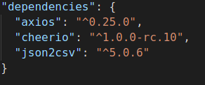
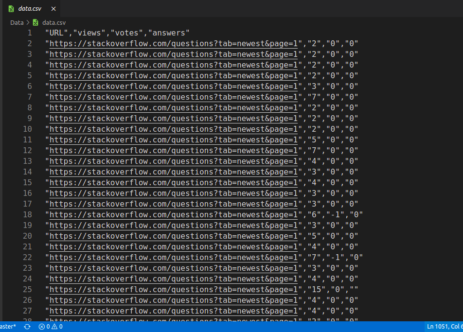
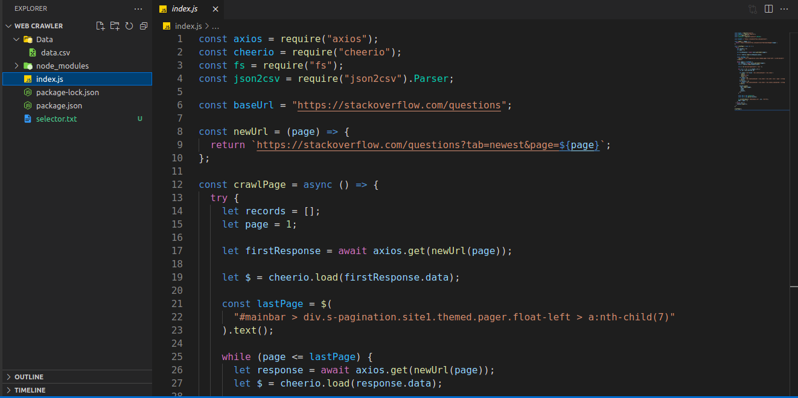

<h1 align="center">
🌐 Web Crawler
</h1>
<p align="center">
Nodejs
</p>


## clone or download
```terminal
$ git clone https://github.com/sudhanshu1309/webcrawler.git
$ npm i
```

## project dependencies



# Screenshots of this project
<div>


</div>

## Standard

[](https://github.com/standard/standard)

## BUGs or comments

[Create new Issues](https://github.com/sudhanshu1309/webcrawler/issues) (preferred)

Email Me: sudhanshutripathi008@gmail.com (welcome, say hi)

## Author
[Sudhanshu Tripathi]
